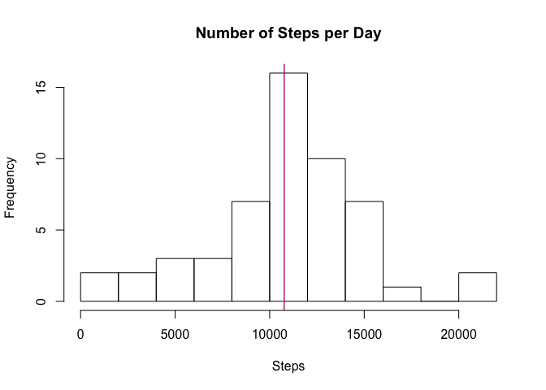
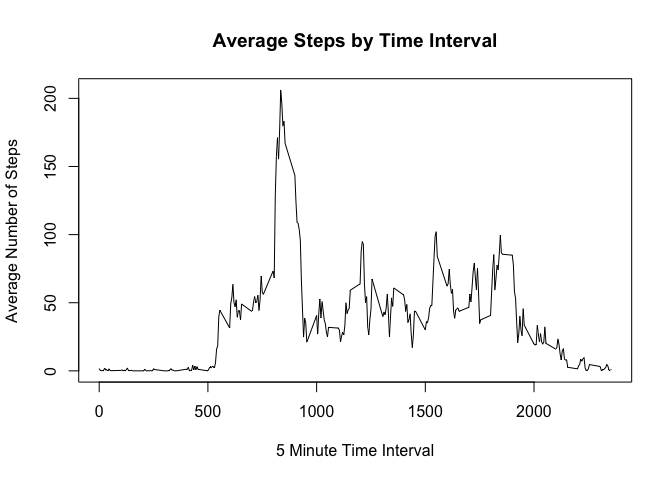
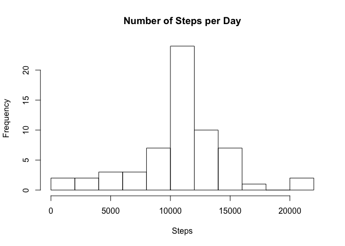

## Loading and preprocessing the data

First, clear all variables from the environment and set global options for knitr.

```r
rm(list=ls())
library(knitr)
opts_chunk$set(cache = TRUE, echo = TRUE)
```

Next, read the zipped activity file into a dataframe and adjust the type of column for easy manipulation.

```r
activity <- read.csv(unz("activity.zip", "activity.csv"), header = TRUE, stringsAsFactors = FALSE)
activity$date <- as.Date(activity$date)
```

---

## What is mean total number of steps taken per day?

First, aggregate the number steps by day and make a histogram of them.
And then, report the mean and median number of steps taken each day.

```r
steps.per.day <- aggregate(steps ~ date, data = activity, sum, na.rm = TRUE)
mean.steps <- mean(steps.per.day$steps)
median.steps <- median(steps.per.day$steps)
hist(steps.per.day$steps, breaks=10, main = 'Number of Steps per Day', xlab = 'Steps')
abline(v=mean.steps, col='blue')
abline(v=median.steps, col='red')
```

<!-- -->

The **mean** total number of steps taken per day is 10766.18868 steps.

The **median** total number of steps taken per day is 10765.000 steps.

---

## What is the average daily activity pattern?

First, aggregate the number of steps by interval. And, make a time series plot (i.e., line graph) with interval as x-axis and average steps (across all days) as y-axis.

```r
steps.by.interval <- aggregate(steps ~ interval, data = activity, FUN = mean, na.rm = TRUE)

with(steps.by.interval, {
  plot(interval, steps, type = 'l',
       main = 'Average Steps by Time Interval',
       xlab = '5 Minute Time Interval',
       ylab = 'Average Number of Steps')
})
```

<!-- -->

```r
interval.of.max.steps <- steps.by.interval$interval[which.max(steps.by.interval$steps)]
```
Which 5-minute interval, on average across all the days in the dataset, contains the maximum number of steps? 

It is the **835th** interval.

---

## Imputing missing values

Calculate and report the total number of missing values in the dataset (i.e. the total number of rows with NAs).

```r
missing.steps <- sum(as.numeric(is.na(activity$steps)))
```
Total 2304 rows are missing.

Devise a strategy for filling in all of the missing values in the dataset. The strategy does not need to be sophisticated. For example, you could use the mean/median for that day, or the mean for that 5-minute interval, etc.

I used a strategy for filing in all of the missing values with the mean for that 5-minute interval. To do that, I got the corresponding mean steps from **"steps.by.interval"** dataframe in above. 

Create a new dataset that is equal to the original dataset but with the missing data filled in.


```r
activity.filled <- activity
fill <- steps.by.interval$steps[(which(is.na(activity$steps)) - 1) %% nrow(steps.by.interval) + 1] 
activity.filled$steps[is.na(activity.filled$steps)] <- fill
```

Make a histogram of the total number of steps taken each day and Calculate and report the mean and median total number of steps taken per day. 

```r
steps.by.interval.filled <- aggregate(steps ~ interval, data = activity.filled, FUN = mean)
steps.per.day.filled <- aggregate(steps ~ date, data = activity.filled, sum)
hist(steps.per.day.filled$steps, breaks=10, main = 'Number of Steps per Day', xlab = 'Steps')
```

<!-- -->

```r
mean.steps.filled <- mean(steps.per.day.filled$steps)
median.steps.filled <- median(steps.per.day.filled$steps)
```
The **mean** total number of steps taken per day is 10766.18868 steps.

The **median** total number of steps taken per day is 10766.189 steps.

Do these values differ from the estimates from the first part of the assignment? What is the impact of imputing missing data on the estimates of the total daily number of steps?

The *mean* value is not changed because I used the mean value for the missing interval. But, the *median* value becomes closer to the *mean* due to the replacement policy.

---

## Are there differences in activity patterns between weekdays and weekends?

Create a new factor variable in the dataset with two levels – “weekday” and “weekend” indicating whether a given date is a weekday or weekend day.

```r
wf <- function (dt) { 
  day_of_week = weekdays(dt)
  ifelse (day_of_week == "Saturday" | day_of_week == "Sunday", "weekend", "weekday")
}
activity.filled <- cbind(activity.filled, daytype = wf(activity.filled$date))
activity.filled$daytype <- as.factor(activity.filled$daytype)
```

Make a panel plot containing a time series plot (i.e. type = "l") of the 5-minute interval (x-axis) and the average number of steps taken, averaged across all weekday days or weekend days (y-axis). The plot should look something like the following, which was creating using simulated data.

```r
steps.by.interval.daytype <- aggregate(steps ~ interval + daytype, data = activity.filled, FUN = mean)

library(lattice)
xyplot(steps ~ interval | daytype, data = steps.by.interval.daytype, type = 'l', xlab = 'Interval', ylab = 'Number of Steps', layout = c(1,2))
```

<!-- -->

